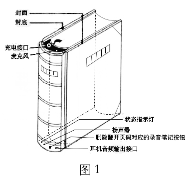
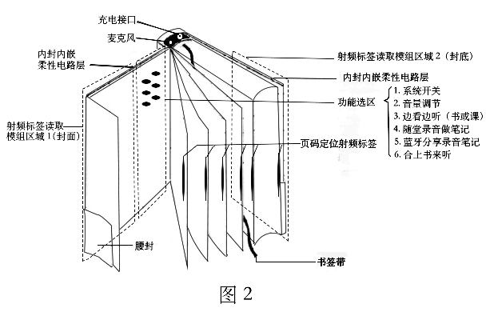

永恒的变，才是不变的真理。

# [iOS 之 OC](md/iOSOCMark.md)

>  Objective-C，
>
>  不朽，存在过就够了。

# [iOS 之 Swift](md/iOSSwiftMark.md)

>  雨燕，
>
>  我来迟了，2019。

# BookList In URL
[Internet Archive](https://archive.org/)

>Internet Archive is a non-profit library of millions of free books, movies, software, music, websites, and more.

[鸠摩搜索](https://www.jiumodiary.com/)

>Search Engine:
>http://www.baidu.com
>http://www.bing.com
>
>Search from the following sites:
read.douban.com (豆瓣)
www.taobao.com (淘宝)
wenku.baidu.com (百度文库)
yun.baidu.com (百度云)
pan.baidu.com (还是百度云?)
guoxuedashi.com (国学大师)
vdisk.weibo.com (微盘)
ishare.iask.sina.com.cn (新浪爱问)
kongfz.com (孔夫子网)
nlc.cn (国家数字图书馆)
www.ximalaya.com (喜马拉雅有声阅读)
(大学图书馆) 等

[Z-Library articles](https://booksc.org/)

>Part of Z-Library project. The world's largest scientific articles store. 70,000,000+ articles for free.

[世界数字图书馆](https://www.wdl.org/zh/)

>搜索 19147 个条目： 有关 193 个国家、 涵盖 公元前 8000 年 至 2000 年

[Jewish Virtual Library](https://www.jewishvirtuallibrary.org/)

>A Project Of AICE. Anything you need to know from Anti-Semitism to Zionism.

[Project Gutenberg](https://www.gutenberg.org/)

>Project Gutenberg is a library of over 60,000 free eBooks.

[Library Genesis](http://libgen.rs/)

[Library Genesis: Miner's Hut / Барак старателей](https://forum.mhut.org/)

>Current alias domains are libgen.rs, libgen.is, libgen.st. Update your bookmarks!
A guide to effective catalog searching.

[FoxGreat](https://foxgreat.com/) &nbsp;&nbsp;&nbsp;[CoderProg](https://coderprog.com/) &nbsp;&nbsp;&nbsp;[AvaxHome](https://avxhm.se/) &nbsp;&nbsp;&nbsp;[LetMeRead](https://www.letmeread.net/) &nbsp;&nbsp;&nbsp;[SaltTiger](https://salttiger.com/) &nbsp;&nbsp;&nbsp;[我爱电子书](https://www.52doc.com/) &nbsp;&nbsp;&nbsp;[书栈网](https://www.bookstack.cn/)

#SmartBooks' Project That Looking For A Team
#射频标签定位装置及电子智能有声书
##专利号：202110269490.5

**产品功能描述：**部分书页或全部书页嵌入页码定位射频标签，封底封面为柔性射频标签读取模组，两者配合定位当前书本翻开的章节或页码，可供选择匹配播放对应音频【讲解音频、教学音频、读后感音频等】。更可以，把以上抽象成文件夹形态定位装置和独立传统附着标签书籍两部分，任一独立传统附着标签书籍放置在文件夹形态定位装置上，文件夹形态定位装置根据书籍上标签，通过网络下载该书籍的标准音频，然后翻译书籍即可供选择匹配播放对应音频。

**产品重要特性：**根据定位的精度，精度要求高的需要标签数量也就多。当标签数量过于密集，此时需要标签分组化并使得标签组之间错落分布【原因：过于密集会导致叠置后面的标签由于信号衰落而无法被射频标签读取模组读取，错落分布利于规避该现象】

**商业模式简述：**专利+平台+品牌。专利保护在申过程中，一旦下来，可以联合书籍印刷印务获得授权书籍嵌入标签的专利使用费；书籍上市后，可以匹配的音频平台化，收获一批专职标签书籍的音频创作者，以此对接需求端的使用者；品牌化，有专利加身，产品品牌化提升价值。