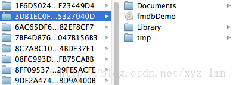
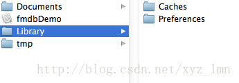
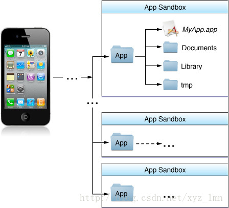

# iOS 文件的操作

[2015-09-05]

由于沙盒机制，应用只能访问自己应用目录下的文件。

**iOS**不像**Android**，没有SD卡概念，不能直接访问图像、视频等内容。iOS应用产生的内容，如图像、文件、缓存内容等都必须存储在自己的沙盒内。默认情况下，每个沙盒含有3个文件夹：Documents, Library 和 tmp。Library包含Caches、Preferences目录。



上面的完整路径为：**用户->资源库->Application Support->iPhone Simulator->6.1->Aplications**

`Documents`：苹果建议将程序创建产生的文件以及应用浏览产生的文件数据保存在该目录下，iTunes备份和恢复的时候会包括此目录

`Library`：存储程序的默认设置或其它状态信息；

`Library/Caches`：存放缓存文件，保存应用的持久化数据，用于应用升级或者应用关闭后的数据保存，不会被itunes同步，所以为了减少同步的时间，可以考虑将一些比较大的文件而又不需要备份的文件放到这个目录下。

`tmp`：提供一个即时创建临时文件的地方，但不需要持久化，在应用关闭后，该目录下的数据将删除，也可能系统在程序不运行的时候清除。



​                                                   					APP  Sandbox

以下介绍获取沙盒路径，操作文件的方法：

**获取应用沙盒根路径：**

```objective-c
-(void)dirHome{  
    NSString *dirHome=NSHomeDirectory();      
    NSLog(@"app_home: %@",dirHome);  
}  
```

**获取Documents目录路径：**

```objective-c
//获取Documents目录  
-(NSString *)dirDoc{  
    //[NSHomeDirectory() stringByAppendingPathComponent:@"Documents"];  
    NSArray *paths = NSSearchPathForDirectoriesInDomains(NSDocumentDirectory, NSUserDomainMask, YES);  
    NSString *documentsDirectory = [paths objectAtIndex:0];  
    NSLog(@"app_home_doc: %@",documentsDirectory);  
    return documentsDirectory;  
}  
```

**获取Library目录路径：**

```objective-c
//获取Library目录  
-(void)dirLib{  
    //[NSHomeDirectory() stringByAppendingPathComponent:@"Library"];  
    NSArray *paths = NSSearchPathForDirectoriesInDomains(NSLibraryDirectory, NSUserDomainMask, YES);  
    NSString *libraryDirectory = [paths objectAtIndex:0];  
    NSLog(@"app_home_lib: %@",libraryDirectory);  
}  
```

**获取Cache目录路径：**

```objective-c
//获取Cache目录  
-(void)dirCache{  
    NSArray *cacPath = NSSearchPathForDirectoriesInDomains(NSCachesDirectory, NSUserDomainMask, YES);  
    NSString *cachePath = [cacPath objectAtIndex:0];  
    NSLog(@"app_home_lib_cache: %@",cachePath);  
}  
```

**获取Tmp目录路径：**

```objective-c
//获取Tmp目录  
-(void)dirTmp{  
    //[NSHomeDirectory() stringByAppendingPathComponent:@"tmp"];  
    NSString *tmpDirectory = NSTemporaryDirectory();  
    NSLog(@"app_home_tmp: %@",tmpDirectory);  
}  
```

**创建文件夹：**

```objective-c
//创建文件夹  
-(void *)createDir{  
    NSString *documentsPath =[self dirDoc];  
    NSFileManager *fileManager = [NSFileManager defaultManager];  
    NSString *testDirectory = [documentsPath stringByAppendingPathComponent:@"test"];  
    // 创建目录  
    BOOL res=[fileManager createDirectoryAtPath:testDirectory withIntermediateDirectories:YES attributes:nil error:nil];  
    if (res) {  
        NSLog(@"文件夹创建成功");  
    }else  
        NSLog(@"文件夹创建失败");  
 }  
```

**创建文件:**

```objective-c
//创建文件  
-(void *)createFile{  
    NSString *documentsPath =[self dirDoc];  
    NSString *testDirectory = [documentsPath stringByAppendingPathComponent:@"test"];  
    NSFileManager *fileManager = [NSFileManager defaultManager];  
    NSString *testPath = [testDirectory stringByAppendingPathComponent:@"test.txt"];  
    BOOL res=[fileManager createFileAtPath:testPath contents:nil attributes:nil];  
    if (res) {  
        NSLog(@"文件创建成功: %@" ,testPath);  
    }else  
        NSLog(@"文件创建失败");  
}  
```

**写数据到文件：**

```objective-c
//写文件  
-(void)writeFile{  
    NSString *documentsPath =[self dirDoc];  
    NSString *testDirectory = [documentsPath stringByAppendingPathComponent:@"test"];  
    NSString *testPath = [testDirectory stringByAppendingPathComponent:@"test.txt"];  
    NSString *content=@"测试写入内容！";  
    BOOL res=[content writeToFile:testPath atomically:YES encoding:NSUTF8StringEncoding error:nil];  
    if (res) {  
        NSLog(@"文件写入成功");  
    }else  
        NSLog(@"文件写入失败");  
}  
```

**读文件数据：**

```objective-c
//读文件  
-(void)readFile{  
    NSString *documentsPath =[self dirDoc];  
    NSString *testDirectory = [documentsPath stringByAppendingPathComponent:@"test"];  
    NSString *testPath = [testDirectory stringByAppendingPathComponent:@"test.txt"];  
//    NSData *data = [NSData dataWithContentsOfFile:testPath];  
//    NSLog(@"文件读取成功: %@",[[NSString alloc] initWithData:data encoding:NSUTF8StringEncoding]);  
    NSString *content=[NSString stringWithContentsOfFile:testPath encoding:NSUTF8StringEncoding error:nil];  
    NSLog(@"文件读取成功: %@",content);  
}  
```

**文件属性：**

```objective-c
//文件属性  
-(void)fileAttriutes{  
    NSString *documentsPath =[self dirDoc];  
    NSString *testDirectory = [documentsPath stringByAppendingPathComponent:@"test"];  
    NSFileManager *fileManager = [NSFileManager defaultManager];  
    NSString *testPath = [testDirectory stringByAppendingPathComponent:@"test.txt"];  
    NSDictionary *fileAttributes = [fileManager attributesOfItemAtPath:testPath error:nil];     
    NSArray *keys;  
    id key, value;  
    keys = [fileAttributes allKeys];  
    int count = [keys count];  
    for (int i = 0; i < count; i++)  
    {  
        key = [keys objectAtIndex: i];  
        value = [fileAttributes objectForKey: key];  
        NSLog (@"Key: %@ for value: %@", key, value);  
    }  
}  
```

**删除文件：**

```objective-c
//删除文件  
-(void)deleteFile{  
    NSString *documentsPath =[self dirDoc];  
    NSString *testDirectory = [documentsPath stringByAppendingPathComponent:@"test"];  
    NSFileManager *fileManager = [NSFileManager defaultManager];  
    NSString *testPath = [testDirectory stringByAppendingPathComponent:@"test.txt"];     
    BOOL res=[fileManager removeItemAtPath:testPath error:nil];  
    if (res) {  
        NSLog(@"文件删除成功");  
    }else  
        NSLog(@"文件删除失败");     
    NSLog(@"文件是否存在: %@",[fileManager isExecutableFileAtPath:testPath]?@"YES":@"NO");  
}  
```

官网文档：

[https://developer.apple.com/library/content/documentation/FileManagement/Conceptual/FileSystemProgrammingGuide/FileSystemOverview/FileSystemOverview.html#//apple_ref/doc/uid/TP40010672-CH2-SW2](https://developer.apple.com/library/content/documentation/FileManagement/Conceptual/FileSystemProgrammingGuide/FileSystemOverview/FileSystemOverview.html#//apple_ref/doc/uid/TP40010672-CH2-SW2)


[BackHome](http://robinshare.github.io/)