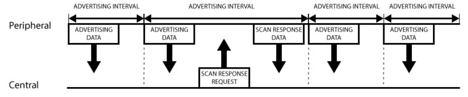
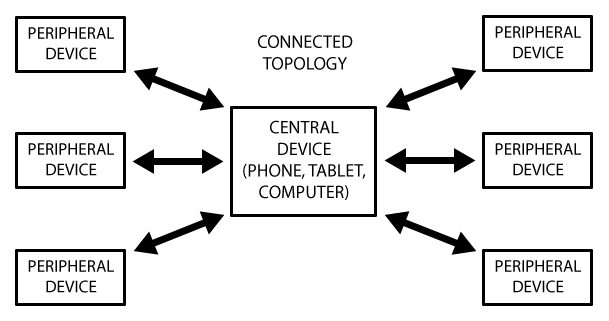
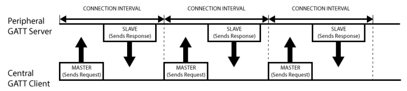

# **GATT Profile 简介**

[2016-07-25]

网上关于讲解 BLE 的内容比较少，看到这篇文章写的非常详细 [Introduction to Bluetooth Low Energy](https://learn.adafruit.com/introduction-to-bluetooth-low-energy?view=all)，作为 BLE 的入门时介绍是非常合适的。本文主要翻译了一下这篇文章。

## 一、引言

现在低功耗蓝牙（BLE）连接都是建立在 **GATT** (Generic Attribute Profile) 协议之上。GATT 是一个在蓝牙连接之上的发送和接收很短的数据段的通用规范，这些很短的数据段被称为属性（Attribute）。

## 二、GAP

详细介绍 GATT 之前，需要了解 **GAP**（Generic Access Profile），它在用来控制设备连接和广播。GAP 使你的设备被其他设备可见，并决定了你的设备是否可以或者怎样与合同设备进行交互。例如 Beacon 设备就只是向外广播，不支持连接，小米手环就等设备就可以与中心设备连接。

#### 1.设备角色

GAP 给设备定义了若干角色，其中主要的两个是：外围设备（Peripheral）和中心设备（Central）。

-  ******外围设备**：这一般就是非常小或者简单的低功耗设备，用来提供数据，并连接到一个更加相对强大的中心设备。例如小米手环。
-  ******中心设备**：中心设备相对比较强大，用来连接其他外围设备。例如手机等。

#### 2.广播数据

在 GAP 中外围设备通过两种方式向外广播数据： **Advertising Data Payload**（广播数据）和 **Scan Response Data Payload**（扫描回复），每种数据最长可以包含 31 byte。这里广播数据是必需的，因为外设必需不停的向外广播，让中心设备知道它的存在。扫描回复是可选的，中心设备可以向外设请求扫描回复，这里包含一些设备额外的信息，例如设备的名字。（广播的数据格式我将另外专门写一个篇博客来讲。）

#### 3.广播流程

GAP 的广播工作流程如下图所示。

从图中我们可以清晰看出广播数据和扫描回复数据是怎么工作的。外围设备会设定一个广播间隔，每个广播间隔中，它会重新发送自己的广播数据。广播间隔越长，越省电，同时也不太容易扫描到。

#### 4.广播的网络拓扑结构

大部分情况下，外设通过广播自己来让中心设备发现自己，并建立 GATT 连接，从而进行更多的数据交换。也有些情况是不需要连接的，只要外设广播自己的数据即可。用这种方式主要目的是让外围设备，把自己的信息发送给多个中心设备。因为基于 GATT 连接的方式的，只能是一个外设连接一个中心设备。 使用广播这种方式最典型的应用就是苹果的 iBeacon。广播工作模式下的网络拓扑图如下：

## 三、GATT

GATT 的全名是 *Generic Attribute Profile*（姑且翻译成：普通属性协议），它定义两个 BLE 设备通过叫做 **Service** 和 **Characteristic** 的东西进行通信。GATT 就是使用了 ATT（Attribute Protocol）协议，ATT 协议把 Service, Characteristic遗迹对应的数据保存在一个查找表中，次查找表使用 16 bit ID 作为每一项的索引。

一旦两个设备建立起了连接，GATT 就开始起作用了，这也意味着，你必需完成前面的 GAP 协议。这里需要说明的是，GATT 连接，必需先经过 GAP 协议。实际上，我们在 Android 开发中，可以直接使用设备的 MAC 地址，发起连接，可以不经过扫描的步骤。这并不意味不需要经过 GAP，实际上在芯片级别已经给你做好了，蓝牙芯片发起连接，总是先扫描设备，扫描到了才会发起连接。

GATT 连接需要特别注意的是：**GATT 连接是独占的**。也就是一个 BLE 外设同时只能被一个中心设备连接。一旦外设被连接，它就会马上停止广播，这样它就对其他设备不可见了。当设备断开，它又开始广播。

中心设备和外设需要双向通信的话，唯一的方式就是建立 GATT 连接。

#### 1.GATT连接的网络拓扑

下图展示了 GTT 连接网络拓扑结构。这里很清楚的显示，一个外设只能连接一个中心设备，而一个中心设备可以连接多个外设。

一旦建立起了连接，通信就是双向的了，对比前面的 GAP 广播的网络拓扑，GAP 通信是单向的。如果你要让两个设备外设能通信，就只能通过中心设备中转。

#### 2.**GATT 通信事务**

GATT 通信的双方是 C/S 关系。外设作为 GATT 服务端（Server），它维持了 ATT 的查找表以及 service 和 characteristic 的定义。中心设备是 GATT 客户端（Client），它向 Server 发起请求。需要注意的是，所有的通信事件，都是由客户端（也叫主设备，Master）发起，并且接收服务端（也叫从设备，Slave）的响应。

一旦连接建立，外设将会给中心设备建议一个**连接间隔**（Connection Interval）,这样，中心设备就会在每个连接间隔尝试去重新连接，检查是否有新的数据。但是，这个连接间隔只是一个建议，你的中心设备可能并不会严格按照这个间隔来执行，例如你的中心设备正在忙于连接其他的外设，或者中心设备资源太忙。

下图展示一个外设（GATT 服务端）和中心设备（GATT 客户端）之间的数据交换流程，可以看到的是，每次都是主设备发起请求：

#### 3.**GATT 结构**

GATT 事务是建立在嵌套的Profiles, Services 和 Characteristics之上的的，如下图所示：

-  ******Profile** Profile 并不是实际存在于 BLE 外设上的，它只是一个被 Bluetooth SIG 或者外设设计者预先定义的 Service 的集合。例如[心率Profile（Heart Rate Profile）](https://developer.bluetooth.org/TechnologyOverview/Pages/HRP.aspx)就是结合了 Heart Rate Service 和 Device Information Service。所有官方通过 GATT Profile 的列表可以从[这里](http://developer.bluetooth.org/TechnologyOverview/Pages/Profiles.aspx#GATT)找到。
-  ******Service** Service 是把数据分成一个个的独立逻辑项，它包含一个或者多个 Characteristic。每个 Service 有一个 UUID 唯一标识。 UUID 有 16 bit 的，或者 128 bit 的。16 bit 的 UUID 是官方通过认证的，需要花钱购买，128 bit 是自定义的，这个就可以自己随便设置。

官方通过了一些标准 Service，完整列表在[这里](https://developer.bluetooth.org/gatt/services/Pages/ServicesHome.aspx)。以 [Heart Rate Service](https://developer.bluetooth.org/gatt/services/Pages/ServiceViewer.aspx?u=org.bluetooth.service.heart_rate.xml)为例，可以看到它的官方通过 16 bit UUID 是 0x180D，包含 3 个 Characteristic：*Heart Rate Measurement*, *Body Sensor Location* 和 *Heart Rate Control Point*，并且定义了只有第一个是必须的，它是可选实现的。

-  ******Characteristic** 在 GATT 事务中的最低界别的是 Characteristic，Characteristic 是最小的逻辑数据单元，当然它可能包含一个组关联的数据，例如加速度计的 X/Y/Z 三轴值。

与 Service 类似，每个 Characteristic 用 16 bit 或者 128 bit 的 UUID 唯一标识。你可以免费使用 Bluetooth SIG 官方定义的[标准 Characteristic](https://developer.bluetooth.org/gatt/characteristics/Pages/CharacteristicsHome.aspx)，使用官方定义的，可以确保 BLE 的软件和硬件能相互理解。当然，你可以自定义 Characteristic，这样的话，就只有你自己的软件和外设能够相互理解。

举个例子， [Heart Rate Measurement Characteristic](https://developer.bluetooth.org/gatt/characteristics/Pages/CharacteristicViewer.aspx?u=org.bluetooth.characteristic.heart_rate_measurement.xml)，这是上面提到的 *Heart Rate Service* 必需实现的 Characteristic，它的 UUID 是 0x2A37。它的数据结构是，开始 8 bit 定义心率数据格式（是UINT8 还是 UINT16？），接下来就是对应格式的实际心率数据。

实际上，和 BLE 外设打交道，主要是通过 Characteristic。你可以从 Characteristic 读取数据，也可以往 Characteristic 写数据。这样就实现了双向的通信。所以你可以自己实现一个类似串口（UART）的 Sevice，这个 Service 中包含两个 Characteristic，一个被配置只读的通道（RX），另一个配置为只写的通道（TX）。

[From where](http://www.race604.com/gatt-profile-intro/)

[BackHome](http://robinshare.github.io/)