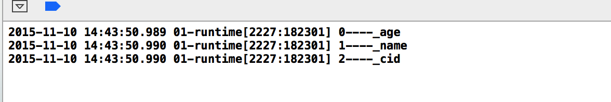

# iOS中的Runtime

[2016-12-07]

## 一、首篇 [iOS捉妖记之Runtime](http://mp.weixin.qq.com/s?__biz=MzA3NzM0NzkxMQ==&mid=2655358465&idx=2&sn=29bb6bb224d36887b5d690d716a4615d&chksm=84e24329b395ca3f261bcafd63bdd42a896dc568ab9f6475239bdd3f70c57fd5aa0f08e49b41&mpshare=1&scene=1&srcid=1204oBmOk1MGAABWZ5V0OO3G#rd)

看完本篇之后你将获得：

-  了解什么是runtime
-  知道可以利用runtime做到哪些事情
-  掌握用runtime开发的常用方法

Runtime是开源的，任何时候你都可以从http://opensource.apple.com获取。事实上查看 Objective-C 源码是我理解它是如何工作的第一种方式，在某些问题上要比读苹果的文档要好。

**引言**

相信很多从事iOS开发的小伙伴们都听过这样一句形容runtime的话：

runtime就像是iOS开发中的妖怪，谁都听说过，但少有人见(用)到过！

这句话是某知名培训机构内某老师对学生们说的一句话，相信不少人尤其是初学的萌新们还没了解过runtime，听了这句话就被吓到了！直接在心里给runtime打个一打标签［危险，慎用，底层，难，用不到，不用掌握］。以至于很多人做了有一段时间的iOS开发却依然对其一知半解……

**定义**

Objective-C 的 Runtime 是一个运行时库（Runtime Library），它是一个主要使用 C 和汇编写的库，为 C 添加了面相对象的能力并创造了 Objective-C。这就是说它在类信息（Class information） 中被加载，完成所有的方法分发，方法转发，等等。Objective-C runtime 创建了所有需要的结构体。

其实就在下个人的理解：runtime就是Objective-C 的灵魂！Objective-C之所以叫Objective-C是因为他比C语言不同，是面向对象的。但是Objective-C为什么有面相对象的能力？就是因为有runtime这个鬼东西！

**进阶**

**我们为什么要学习runtime？**

-  runtime可以遍历对象的属性
-  runtime可以动态添加/修改属性，动态添加/修改/替换方法，动态添加/修改/替换协议
-  runtime可以动态创建类/对象/协议等等
-  runtime可以方法拦截调用

其实runtime所能做的还不止这些，你甚至可以利用它来把一个Class A的实例对象a在程序中当作Class B的实例对象来用。所以很多iOS开发者把runtime叫做obj-C的黑魔法！

**常用方法**

先来个最简单最基本的也是几乎所有runtime文必备的例子：

```markdown
obj-C: [obj func];

runtime：objc_msgSend(obj, @selector(func);
```

很多初学者除了知道runtime把对象的方法调用转化成消息发送的代码之后就不知道其他的了，但是显然仅仅知道上述的转化并没有什么“吡－”用，我们来看runtime中比较常用(实用)的几种基本用法：

-  遍历对象的属性

首先定义一个简单的类Person

```objective-c
@interface Person : NSObject

@property (nonatomic, copy) NSString *name;

@property (nonatomic, assign) NSInteger age;

@end
```

然后在需要遍历对象的属性时

```objective-c
id personClass = objc_getClass("Person");

unsigned int outCount;

objc_property_t *properties = class_copyPropertyList(personClass, &outCount);

for (int i = 0; i < outCount; ++i) {

objc_property_t property = properties[i];

printf("%s:%s\n", property_getName(property), property_getAttributes(property));

}
free(properties);
```

这时就会打印出这个类对象的属性相关信息：

```objective-c
name:T@"NSString",C,N,V_name

age:Tq,N,V_age
```

-  消息转发

［消息转发］指的就是我上面提到的动态方法解析，重定向以及消息转发，我们先来看一张图：


动态方法解析:

从上图可以知道，当对一个实例对象obj发送一条消息func时[obj func]，当前obj如果没有对func实现对应的方法，那么就runtime会调用+ (BOOL)resolveInstanceMethod:(SEL)sel方法允许开发者对当前受到的消息func做出响应，这就是动态方法解析。

继续拿上面的Person举例子，给Person类加一个体重weight属性

```objective-c
@property (nonatomic, assign) NSInteger weight;
```

然后在.m文件中加入一下代码

```objective-c
@implementation Person

@dynamic weight;  //避免自动生成getter/setter方法

//重写resolveInstanceMethod方法，动态方法解析
+ (BOOL)resolveInstanceMethod:(SEL)sel{
  if (sel == @selector(setWeight:)) {
  class_addMethod([self class], sel, (IMP)setPropertyDynamic, "v@:");
  return YES;
  }
  return [super resolveInstanceMethod:sel];
}

//用来响应setWeight的c语言方法
void setPropertyDynamic(id self, SEL _cmd) {
NSLog(@"Dynamic setWeight");
}

@end
```

然后可以在代码就调用Person的setWeight方法

```objective-c
Person *lision = [[Person alloc] init];
lision.weight = 75;
```

这时候如果不重写`+ (BOOL)resolveInstanceMethod:(SEL)sel`方法本应该异常的，但是你可以发现程序会打印出信息:

```objective-c
Dynamic setWeight
```

**重定向:**

那么还是看图说话，如果没有重写`+ (BOOL)resolveInstanceMethod:(SEL)sel`方法，那就就会调用`- (id)forwardingTargetForSelector:(SEL)aSelector`方法，把这个消息让另一个对象来处理，这次叫做重定向。

跟着上面的例子走，先另一个类People用来等待重定向：

```objective-c
@interface People : NSObject

@end
```

给新写的People类加一个weight方法，但是注意：People没有weight属性！

```objective-c
- (NSInteger)weight{
return 70;
}
```

接下来我们重写`- (id)forwardingTargetForSelector:(SEL)aSelector`方法：

```objective-c
- (id)forwardingTargetForSelector:(SEL)aSelector{
    if (aSelector == @selector(weight)) {
    People *people = [[People alloc] init];
    return people;
    }
    return [super forwardingTargetForSelector:aSelector];
}
```

然后我们在刚才的执行代码中：

```objective-c
NSLog(@"weight = %ld", lision.weight);
```

然后运行，经历过上面的例子你肯定知道不会异常啦，而且你会发现虽然你给weight属性赋值明明是75，可是打印结果是：weight = 70。这就是Person类`- (id)forwardingTargetForSelector:(SEL)aSelector`方法中把这条信息抛给了people对象，调用了People类的weight方法！

**消息转发：**

那么如果上面的两个方法都没有重写，并且消息依然是当前对象没有实现的方法，runtime才会启用消息转发调用`– (void)forwardInvocation:(NSInvocation *)anInvocation`，需要注意的是很多文章没有提到这个方法花费代价较大，如果要实现把消息转发类似的功能建议最好使用重定向，而且再调用这个方法前runtime会先调用`- (NSMethodSignature *)methodSignatureForSelector:(SEL)aSelector`方法。

我们跟着上面的例子，继续给Person类加入属性：

```objective-c
@property (nonatomic, copy) NSString *ID;
```

以及上面提到的两个方法：

```objective-c
- (NSMethodSignature *)methodSignatureForSelector:(SEL)aSelector{
    if (aSelector == @selector(setID:)) {
    NSMethodSignature *sig = [NSMethodSignature signatureWithObjCTypes:"v@:"];
    //"v@:"代表的意思参见Objective-C Type Encodings，这里的意思是返回值为空
    return sig;
}
return nil;
}

- (void)forwardInvocation:(NSInvocation *)anInvocation{
    People *people = [[People alloc] init];
    if ([people respondsToSelector:anInvocation.selector]) {
    [anInvocation invokeWithTarget:people];
    }
}
```

别忘记了在People类中添加对应的方法：

```objective-c
- (void)setID:(NSString *)ID{
	NSLog(@"People setID: %@", ID);
}
```

最后，我门只需要在执行代码块中加入代码：

```objective-c
lision.ID = @"xxxx";
```

结果显而易见，相信各位都知道将会打印信息：

```objective-c
People setID: xxxx
```

写在最后

其实runtime就是我们无时无刻不在用的东西，只是人们习惯对看不到的东西怀有恐惧心理而已。我们平时的obj-C代码都是被runtime转译为c和汇编语言运行的。我个人认为大公司为什么喜欢在面试时问runtime相关的东西是因为大公司往往不仅仅要会干活的人，它还会要求这些会干活的人知道其中的原理！我们自己也应该要求自己或多或少的理解这些原理，知道我们为什么写出的obj-C代码经历了哪些过程run到我们的设备上，不要敲了很多年的代码还是一只只会干活的码农。

## 二、中篇 [runtime之理解](http://www.jianshu.com/p/927c8384855a)

Runtime是想要做好iOS开发，或者说是真正的深刻的掌握OC这门语言所必需理解的东西。最近在学习Runtime，有自己的一些心得，整理如下，

一为 查阅方便

二为 或许能给他人一些启发，

三为 希望得到大家对这篇整理不足之处的一些指点。

## 什么是Runtime

-  我们写的代码在程序运行过程中都会被转化成runtime的C代码执行，例如`[target doSomething];`会被转化成`objc_msgSend(target, @selector(doSomething));`。
-  OC中一切都被设计成了对象，我们都知道一个类被初始化成一个实例，这个实例是一个对象。实际上一个类本质上也是一个对象，在runtime中用结构体表示。
-  相关的定义：

```objective-c
/// 描述类中的一个方法
typedef struct objc_method *Method;

/// 实例变量
typedef struct objc_ivar *Ivar;

/// 类别Category
typedef struct objc_category *Category;

/// 类中声明的属性
typedef struct objc_property *objc_property_t;
```

-  类在runtime中的表示

```objective-c
//类在runtime中的表示
struct objc_class {
    Class isa;//指针，顾名思义，表示是一个什么，
    //实例的isa指向类对象，类对象的isa指向元类

#if !__OBJC2__
    Class super_class;  //指向父类
    const char *name;  //类名
    long version;
    long info;
    long instance_size
    struct objc_ivar_list *ivars //成员变量列表
    struct objc_method_list **methodLists; //方法列表
    struct objc_cache *cache;//缓存
    //一种优化，调用过的方法存入缓存列表，下次调用先找缓存
    struct objc_protocol_list *protocols //协议列表
    #endif
} OBJC2_UNAVAILABLE;
/* Use `Class` instead of `struct objc_class *` */
```

**获取列表**

有时候会有这样的需求，我们需要知道当前类中每个属性的名字（比如字典转模型，字典的Key和模型对象的属性名字不匹配）。

我们可以通过runtime的一系列方法获取类的一些信息（包括属性列表，方法列表，成员变量列表，和遵循的协议列表）。

```objective-c
 unsigned int count;
        //获取属性列表
        objc_property_t *propertyList = class_copyPropertyList([self class], &count);
        for (unsigned int i=0; i<count; i++) {
            const char *propertyName = property_getName(propertyList[i]);
            NSLog(@"property---->%@", [NSString stringWithUTF8String:propertyName]);
        }
        
        //获取方法列表
        Method *methodList = class_copyMethodList([self class], &count);
        for (unsigned int i=0; i<count; i++) {
            Method method = methodList[i];
            NSLog(@"method---->%@", NSStringFromSelector(method_getName(method)));
        }
        
        //获取成员变量列表
        Ivar *ivarList = class_copyIvarList([self class], &count);
        for (unsigned int i=0; i<count; i++) {
            Ivar myIvar = ivarList[i];
            const char *ivarName = ivar_getName(myIvar);
            NSLog(@"Ivar---->%@", [NSString stringWithUTF8String:ivarName]);
        }
        
        //获取协议列表
        __unsafe_unretained Protocol **protocolList = class_copyProtocolList([self class], &count);
        for (unsigned int i=0; i<count; i++) {
            Protocol *myProtocal = protocolList[i];
            const char *protocolName = protocol_getName(myProtocal);
            NSLog(@"protocol---->%@", [NSString stringWithUTF8String:protocolName]);
        }
```

在Xcode上跑一下看看输出吧，需要给你当前的类写几个属性，成员变量，方法和协议，不然获取的列表是没有东西的。
注意，调用这些获取列表的方法别忘记导入头文件`#import <objc/runtime.h> `。

## 方法调用

让我们看一下方法调用在运行时的过程（参照前文类在runtime中的表示）

**如果用实例对象调用实例方法，会到实例的isa指针指向的对象（也就是类对象）操作。**

**如果调用的是类方法，就会到类对象的isa指针指向的对象（也就是元类对象）中操作。**

1. 首先，在相应操作的对象中的缓存方法列表中找调用的方法，如果找到，转向相应实现并执行。
2. 如果没找到，在相应操作的对象中的方法列表中找调用的方法，如果找到，转向相应实现执行
3. 如果没找到，去父类指针所指向的对象中执行1，2.
4. 以此类推，如果一直到根类还没找到，转向拦截调用。
5. 如果没有重写拦截调用的方法，程序报错。

**以上的过程给我带来的启发：**

-  重写父类的方法，并没有覆盖掉父类的方法，只是在当前类对象中找到了这个方法后就不会再去父类中找了。
-  如果想调用已经重写过的方法的父类的实现，只需使用`super`这个编译器标识，它会在运行时跳过在当前的类对象中寻找方法的过程。

## 拦截调用

在方法调用中说到了，如果没有找到方法就会转向拦截调用。
那么什么是拦截调用呢。
拦截调用就是，在找不到调用的方法程序崩溃之前，你有机会通过重写`NSObject`的四个方法来处理。

```objective-c
+ (BOOL)resolveClassMethod:(SEL)sel;
+ (BOOL)resolveInstanceMethod:(SEL)sel;
//后两个方法需要转发到其他的类处理
- (id)forwardingTargetForSelector:(SEL)aSelector;
- (void)forwardInvocation:(NSInvocation *)anInvocation;
```

-  第一个方法是当你调用一个不存在的类方法的时候，会调用这个方法，默认返回NO，你可以加上自己的处理然后返回YES。
-  第二个方法和第一个方法相似，只不过处理的是实例方法。
-  第三个方法是将你调用的不存在的方法重定向到一个其他声明了这个方法的类，只需要你返回一个有这个方法的target。
-  第四个方法是将你调用的不存在的方法打包成`NSInvocation`传给你。做完你自己的处理后，调用`invokeWithTarget:`方法让某个target触发这个方法。

## 动态添加方法

重写了拦截调用的方法并且返回了YES，我们要怎么处理呢？
有一个办法是根据传进来的`SEL`类型的selector动态添加一个方法。

首先从外部隐式调用一个不存在的方法：

```objective-c
//隐式调用方法
[target performSelector:@selector(resolveAdd:) withObject:@"test"];
```

然后，在target对象内部重写拦截调用的方法，动态添加方法。

```objective-c
void runAddMethod(id self, SEL _cmd, NSString *string){
    NSLog(@"add C IMP ", string);
}

+ (BOOL)resolveInstanceMethod:(SEL)sel{
    //给本类动态添加一个方法
    if ([NSStringFromSelector(sel) isEqualToString:@"resolveAdd:"]) {
        class_addMethod(self, sel, (IMP)runAddMethod, "v@:*");
    }
    return YES;
}
```

其中`class_addMethod`的四个参数分别是：

1. `Class cls` 给哪个类添加方法，本例中是self
2. `SEL name` 添加的方法，本例中是重写的拦截调用传进来的selector。
3. `IMP imp` 方法的实现，C方法的方法实现可以直接获得。如果是OC方法，可以用`+ (IMP)instanceMethodForSelector:(SEL)aSelector;`获得方法的实现。
4. `"v@:*"`方法的签名，代表有一个参数的方法。

## 关联对象

现在你准备用一个系统的类，但是系统的类并不能满足你的需求，你需要额外添加一个属性。
这种情况的一般解决办法就是继承。
但是，只增加一个属性，就去继承一个类，总是觉得太麻烦类。
这个时候，runtime的关联属性就发挥它的作用了。

```objective-c
//首先定义一个全局变量，用它的地址作为关联对象的key
static char associatedObjectKey;
//设置关联对象
objc_setAssociatedObject(target, &associatedObjectKey, @"添加的字符串属性", OBJC_ASSOCIATION_RETAIN_NONATOMIC); //获取关联对象
NSString *string = objc_getAssociatedObject(target, &associatedObjectKey);
NSLog(@"AssociatedObject = %@", string);
```

`objc_setAssociatedObject`的四个参数：

1. `id object`给谁设置关联对象。
2. `const void *key`关联对象唯一的key，获取时会用到。
3. `id value`关联对象。
4. `objc_AssociationPolicy`关联策略，有以下几种策略：

```objective-c
enum {
    OBJC_ASSOCIATION_ASSIGN = 0,
    OBJC_ASSOCIATION_RETAIN_NONATOMIC = 1, 
    OBJC_ASSOCIATION_COPY_NONATOMIC = 3,
    OBJC_ASSOCIATION_RETAIN = 01401,
    OBJC_ASSOCIATION_COPY = 01403 
};
```

如果你熟悉OC，看名字应该知道这几种策略的意思了吧。

`objc_getAssociatedObject`的两个参数。

1. `id object`获取谁的关联对象。
2. `const void *key`根据这个唯一的key获取关联对象。

其实，你还可以把添加和获取关联对象的方法写在你需要用到这个功能的类的类别中，方便使用。

```objective-c
//添加关联对象
- (void)addAssociatedObject:(id)object{
    objc_setAssociatedObject(self, @selector(getAssociatedObject), object, OBJC_ASSOCIATION_RETAIN_NONATOMIC);
}
//获取关联对象
- (id)getAssociatedObject{
    return objc_getAssociatedObject(self, _cmd);
}
```

**注意：**这里面我们把`getAssociatedObject`方法的地址作为唯一的key，`_cmd`代表当前调用方法的地址。

## 方法交换

方法交换，顾名思义，就是将两个方法的实现交换。例如，将A方法和B方法交换，调用A方法的时候，就会执行B方法中的代码，反之亦然。
话不多说，这是参考Mattt大神在NSHipster上的文章自己写的代码。

```objective-c
#import "UIViewController+swizzling.h"
#import <objc/runtime.h>

@implementation UIViewController (swizzling)

//load方法会在类第一次加载的时候被调用
//调用的时间比较靠前，适合在这个方法里做方法交换
+ (void)load{
    //方法交换应该被保证，在程序中只会执行一次
    static dispatch_once_t onceToken;
    dispatch_once(&onceToken, ^{

        //获得viewController的生命周期方法的selector
        SEL systemSel = @selector(viewWillAppear:);
        //自己实现的将要被交换的方法的selector
        SEL swizzSel = @selector(swiz_viewWillAppear:);
        //两个方法的Method
        Method systemMethod = class_getInstanceMethod([self class], systemSel);
        Method swizzMethod = class_getInstanceMethod([self class], swizzSel);

        //首先动态添加方法，实现是被交换的方法，返回值表示添加成功还是失败
        BOOL isAdd = class_addMethod(self, systemSel, method_getImplementation(swizzMethod), method_getTypeEncoding(swizzMethod));
        if (isAdd) {
            //如果成功，说明类中不存在这个方法的实现
            //将被交换方法的实现替换到这个并不存在的实现
            class_replaceMethod(self, swizzSel, method_getImplementation(systemMethod), method_getTypeEncoding(systemMethod));
        }else{
            //否则，交换两个方法的实现
            method_exchangeImplementations(systemMethod, swizzMethod);
        }

    });
}

- (void)swiz_viewWillAppear:(BOOL)animated{
    //这时候调用自己，看起来像是死循环
    //但是其实自己的实现已经被替换了
    [self swiz_viewWillAppear:animated];
    NSLog(@"swizzle");
}

@end
```

在一个自己定义的viewController中重写viewWillAppear

```objective-c
- (void)viewWillAppear:(BOOL)animated{
    [super viewWillAppear:animated];
    NSLog(@"viewWillAppear");
}
```

Run起来看看输出吧！

**我的理解：**

-  方法交换对于我来说更像是实现一种思想的最佳技术：AOP面向切面编程。
-  既然是切面，就一定不要忘记，交换完再调回自己。
-  一定要保证只交换一次，否则就会很乱。
-  最后，据说这个技术很危险，谨慎使用。

**完**

## 三、末篇 [runtime之应用](http://www.jianshu.com/p/364eab29f4f5)

#### 1.什么是runtime?

runtime是一套底层的**C语言API**，包含很多强大实用的C语言数据类型和C语言函数，平时我们编写的OC代码，底层都是基于runtime实现的。

#### 2.runtime有什么作用？

1.能动态产生一个类，一个成员变量，一个方法
2.能动态修改一个类，一个成员变量，一个方法
3.能动态删除一个类，一个成员变量，一个方法

#### 3.常用的头文件

```objective-c
#import <objc/runtime.h> //包含对类、成员变量、属性、方法的操作
#import <objc/message.h> //包含消息机制
```

#### **4.常用方法**

```objective-c
class_copyIvarList（）//返回一个指向类的成员变量数组的指针
class_copyPropertyList（）//返回一个指向类的属性数组的指针
```

**注意：根据Apple官方runtime.h文档所示，上面两个方法返回的指针，在使用完毕之后必须free()。**

```objective-c
ivar_getName（）//获取成员变量名-->C类型的字符串
property_getName（）//获取属性名-->C类型的字符串
-------------------------------------
typedef struct objc_method *Method;
class_getInstanceMethod（） 
class_getClassMethod（）//以上两个函数传入返回Method类型
---------------------------------------------------
method_exchangeImplementations（）//交换两个方法的实现
```

#### **5.runtime在开发中的用途**

1.动态的遍历一个类的所有成员变量，用于字典转模型,归档解档操作

代码如下：

```objective-c
- (void)viewDidLoad {    
    [super viewDidLoad];    
    /** 利用runtime遍历一个类的全部成员变量     
        1.导入头文件<objc/runtime.h>     */    
    unsigned int count = 0;   
   /** Ivar:表示成员变量类型 */    
    Ivar *ivars = class_copyIvarList([BDPerson class], &count);//获得一个指向该类成员变量的指针   
   for (int i =0; i < count; i ++) {        
  //获得Ivar      
    Ivar ivar = ivars[i];        //根据ivar获得其成员变量的名称--->C语言的字符串      
    const char *name = ivar_getName(ivar);       
     NSString *key = [NSString stringWithUTF8String:name];      
    NSLog(@"%d----%@",i,key);
  }
}
```

运行结果如下：



获取一个类的全部属性：


结果如下：


应用场景：

-  可以利用遍历类的属性，来快速的进行归档操作。
-  将从网络上下载的json数据进行字典转模型。

```objective-c
//注意：归档解档需要遵守<NSCoding>协议，实现以下两个方法
- (void)encodeWithCoder:(NSCoder *)encoder{    
    //归档存储自定义对象    
    unsigned int count = 0;  
    //获得指向该类所有属性的指针   
    objc_property_t *properties =     class_copyPropertyList([BDPerson class], &count);   
    for (int i =0; i < count; i ++) {        
    //获得        
    objc_property_t property = properties[i];        //根据objc_property_t获得其属性的名称--->C语言的字符串       
   const char *name = property_getName(property);   
   NSString *key = [NSString   stringWithUTF8String:name];       
   //      编码每个属性,利用kVC取出每个属性对应的数值            
   [encoder encodeObject:[self valueForKeyPath:key] forKey:key]; 
 	}
}

- (instancetype)initWithCoder:(NSCoder *)decoder{    
      //归档存储自定义对象    
        unsigned int count = 0;   
     //获得指向该类所有属性的指针   
       objc_property_t *properties = class_copyPropertyList([BDPerson class], &count);   
       for (int i =0; i < count; i ++) {       
       objc_property_t property = properties[i];        //根据objc_property_t获得其属性的名称--->C语言的字符串       
       const char *name = property_getName(property); 
         NSString *key = [NSString stringWithUTF8String:name];        //解码每个属性,利用kVC取出每个属性对应的数值      
       [self setValue:[decoder decodeObjectForKey:key] forKeyPath:key];  
}   
 return self;
}
```

二、交换方法
  通过runtime的`method_exchangeImplementations(Method m1, Method m2)`方法，可以进行交换方法的实现；一般用自己写的方法（常用在自己写的框架中，添加某些防错措施）来替换系统的方法实现，常用的地方有：

在数组中，越界访问程序会崩，可以用自己的方法添加判断防止程序出现崩溃数组或字典中不能添加nil，如果添加程序会崩，用自己的方法替换系统防止系统崩溃

...
代码实现如下：


再次运行刚才的程序：


[BackHome](http://robinshare.github.io/)