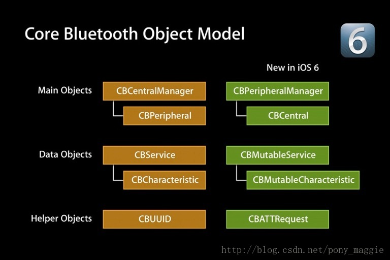
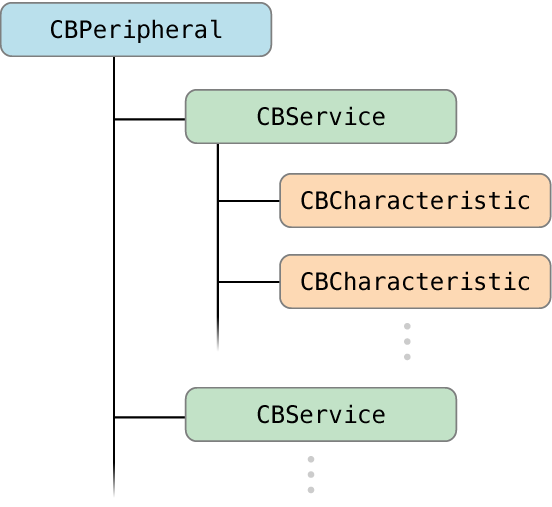

# iOS 蓝牙的开发专题(总)

[2016-08-02]

>  最近做一个iOS蓝牙设备的项目，需要用iOS连接外部蓝牙设备，就对iOS蓝牙相关技术做了一些研究，主要分为下面几个专题

## 一、蓝牙相关基础知识

```markdown
-蓝牙常见名称和缩写
-蓝牙基础知识
-蓝牙和版本的使用限制
```

#### 1-蓝牙常见名称和缩写

```markdown
MFI ======= make for ipad ,iphone, itouch 专们为苹果设备制作的设备
BLE ==== buletouch low energy，蓝牙4.0设备因为低耗电，所以也叫做BLE
peripheral,central == 外设和中心,发起连接的是central，被连接的设备为perilheral
service and characteristic === 服务和特征 每个设备会提供服务和特征，类似于服务端的api，但是机构不同。每个外设会有很多服务，每个服务中包含很多字段，这些字段的权限一般分为 读read，写write，通知notiy几种，就是我们连接设备后具体需要操作的内容。
Description 每个characteristic可以对应一个或多个Description用户描述characteristic的信息或属性
MFI === 开发使用ExternalAccessory 框架
4.0 BLE === 开发使用CoreBluetooth 框架
```

#### 2-蓝牙基础知识

>  CoreBluetooth框架的核心其实是两个东西，peripheral和central, 可以理解成外设和中心。对应他们分别有一组相关的API和类



-  这两组api分别对应不同的业务场景，左侧叫做中心模式，就是以你的app作为中心，连接其他的外设的场景，而右侧称为外设模式，使用手机作为外设别其他中心设备操作的场景。
-  服务和特征，特征的属性(service and characteristic):
   每个设备都会有一些服务，每个服务里面都会有一些特征，特征就是具体键值对，提供数据的地方。每个特征属性分为这么几种：读，写，通知这么几种方式。

```objective-c
//objcetive c特征的定义枚举
  typedef NS_OPTIONS(NSUInteger, CBCharacteristicProperties) {
      CBCharacteristicPropertyBroadcast											= 0x01,
      CBCharacteristicPropertyRead												= 0x02,
      CBCharacteristicPropertyWriteWithoutResponse		   					   	= 0x04,
      CBCharacteristicPropertyWrite												= 0x08,
      CBCharacteristicPropertyNotify											= 0x10,
      CBCharacteristicPropertyIndicate											= 0x20,
      CBCharacteristicPropertyAuthenticatedSignedWrites							  = 0x40,
      CBCharacteristicPropertyExtendedProperties								 = 0x80,
      CBCharacteristicPropertyNotifyEncryptionRequired NS_ENUM_AVAILABLE(NA, 6_0)   = 0x100,
      CBCharacteristicPropertyIndicateEncryptionRequired NS_ENUM_AVAILABLE(NA, 6_0)	= 0x200
  };
```

外设、服务、特征间的关系



蓝牙中心模式流程

```markdown
- 建立中心角色
- 扫描外设(discover)
- 扫描外设中的服务和特征(discover)
		-获取外设的services
		-获取外设的Characteristics,获取Characteris的值,获取Characteristics的Descriptor和Descritor的值
- 与外设做数据交互(explore and interact)
- 订阅Characteristic的通知
- 断开连接(disconnect)
```

蓝牙外设模式流程

```markdown
- 启动一个Peripheral管理对象
- 本地Peripheral设置服务,特性,描述，权限等等
- Peripheral发送广告
- 设置处理订阅、取消订阅、读characteristic、写characteristic的委托方法
```

蓝牙设备状态

```markdown
1. 待机状态（standby）：设备没有传输和发送数据，并且没有连接到任何设备
2. 广播状态（Advertiser）：周期性广播状态
3. 扫描状态（Scanner）：主动寻找正在广播的设备
4. 发起链接状态（Initiator）：主动向扫描设备发起连接。
5. 主设备（Master）：作为主设备连接到其他设备。
6. 从设备（Slave）：作为从设备连接到其他设备。
```

蓝牙设备的五种工作状态

```markdown
1. 准备（standby）
2. 广播（advertising）
3. 监听扫描（Scanning
4. 发起连接（Initiating）
5. 已连接（Connected）
```

名词解释

-  GAAT : Generic Attribute Profile , GATT配置文件是一个通用规范，用于在BLE链路上发送和接收被称为“属性”的数据块。目前所有的BLE应用都基于GATT。 蓝牙SIG规定了许多低功耗设备的配置文件。配置文件是设备如何在特定的应用程序中工作的规格说明。注意一个设备可以实现多个配置文件。例如，一个设备可能包括心率监测仪和电量检测。
-  Characteristic 一个characteristic包括一个单一变量和0-n个用来描述characteristic变量的descriptor，characteristic可以被认为是一个类型，类 似于类。
-  Descriptor Descriptor用来描述characteristic变量的属性。例如，一个descriptor可以规定一个可读的描述，或者一个characteristic变量可接受的范围，或者一个characteristic变量特定的测量单位。 Service service是characteristic的集合。例如，你可能有一个叫“Heart Rate Monitor(心率监测仪)”的service，它包括了很多characteristics，如“heart rate measurement(心率测量)”等。你可以在bluetooth.org 找到一个目前支持的基于GATT的配置文件和服务列表。


#### 3-蓝牙和版本的使用限制

```markdown
蓝牙2.0 === 越狱设备
蓝牙4.0 === IOS6 以上
MFI认证设备（Make For ipod/ipad/iphone） === 无限制
```


## 二、iOS连接外设的代码实现

```markdown
-建立中心角色
-扫描外设(discover)
-扫描外设中的服务和特征(discover)
		-获取外设的services
		-获取外设的Characteristics,获取Characteris的值,获取Characteristics的Descriptor和Descritor的值
-与外设做数据交互(explore and interact)
-订阅Characteristic的通知
-断开连接(disconnect)
```

## 三、app作为外设被连接的实现

```markdown
-打开peripheralManager,设置peripheralManager的委托
-创建characteristics,characteristics的descrition创建service,把characteristics添加到service中,再把service添加到peripheralManager中
-开启广播advertising
-对central的操作进行响应
		-读characteristics请求
		-写characteristics请求
		-订阅和取消订阅characteristics
```

## 四、BabyBluetooth蓝牙库

```markdown
-CoreBluetooth有哪些问题
-BabyBluetooth优点和快速使用
```


[From where](http://liuyanwei.jumppo.com/2015/07/17/ios-BLE-0.html)

[BackHome](http://robinshare.github.io/)