# iOS开发UI篇之使用Quartz2D绘制椭圆进度条

[2017-04-07]

[【SportProgressView】](https://github.com/RobinShare/SportProgressView)

-  Quartz 2D能完成的工作

-  -  绘制图形 : 线条\三角形\矩形\圆\弧等
   -  绘制文字
   -  绘制\生成图片(图像)
   -  读取\生成PDF
   -  截图\裁剪图片
   -  自定义UI控件

在iOS开发中的价值:

-  绘制一些系统UIKit框架中不好展示的内容，例如饼图
-  自定义一些控件
-  不添加UI控件的情况下，使UI内容更丰富
-  ……

**iOS中，大部分控件都是Quartz2D绘制出来的**

**今天讲的是绘制一个椭圆环跑道式进度控件，具体效果如下：（使用了Masonry进行自动布局）**

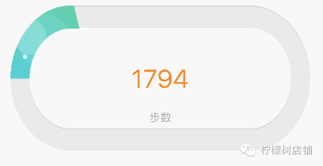

（当前步数是1794步，设置的目标步数是13000步的效果图）

在这之前，先简单介绍两个绘制弧线路径的函数，分别是CGPathAddArc 和CGPathAddArcToPoint。

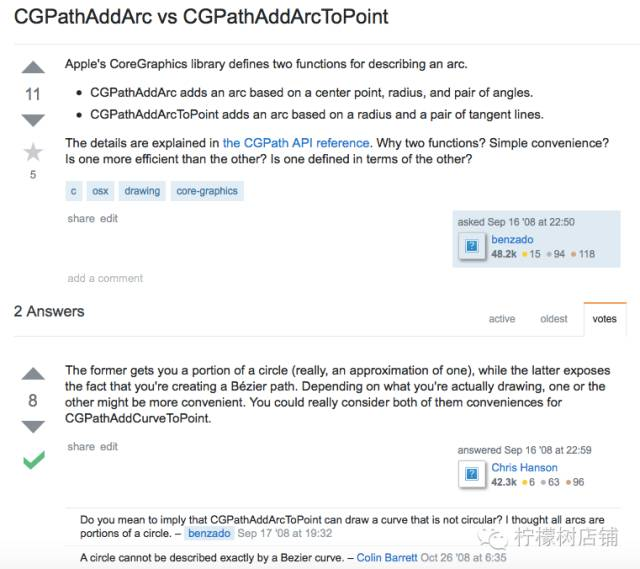

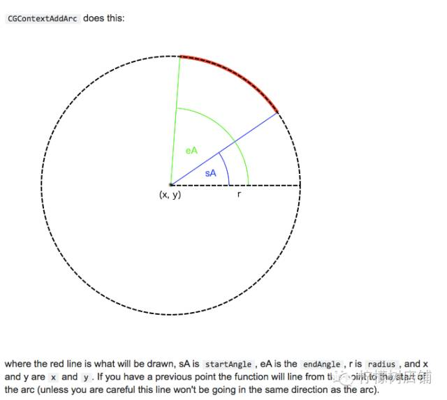

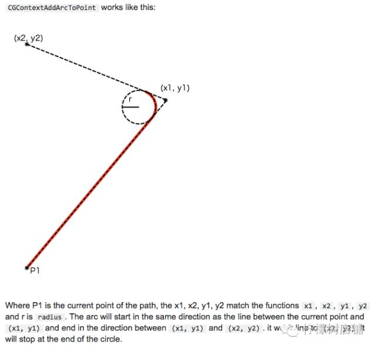

基本介绍就差不多了，这里就不一一对比官方文档，有兴趣的可以看官方的解释，或许理解起来更加清楚。这里开始给大家介绍这个绘制的思路：

因为进度控件是从左上开始的，且又有弧线构成，所以这里采取先把控件分割，组构：上四分之一圆+上直线+二分之一圆+下直线+下四分之一圆（如下图示），具体逻辑体现在代码中：

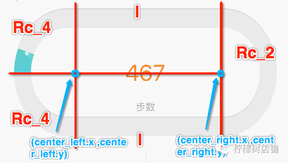

drawRect:

为什么要实现drawRect:方法才能绘图到view上？

因为在drawRect:方法中才能取得跟view相关联的图形上下文

drawRect:中取得的上下文

在drawRect:方法中取得上下文后，就可以绘制东西到view上

**View内部有个layer（图层）属性，drawRect:方法中取得的是一个Layer Graphics Context，因此，绘制的东西其实是绘制到view的layer上去了**

*View之所以能显示东西，完全是因为它内部的layer*

drawRect:方法的调用？

-  当view第一次显示到屏幕上时，系统会创建好一个跟当前view相关的Layer上下文
-  系统会通过此上下文，在drawRect:方法中绘制好当前view的内容
-  主动让view重绘内容的时候，调用setNeedsDisplay或者setNeedsDisplayInRect:。我们主动调用drawRect:方法是无效的。
-  调用view的setNeedsDisplay或者setNeedsDisplayInRect:时。
-  注意：setNeedsDisplay和setNeedsDisplayInRect:方法调用后，屏幕并不是立即刷新，而是会在下一次刷新屏幕的时候把绘制的内容显示出来。

**也正是系统会在调用这个方法之前创建一个与该view相关的上下文，才让我们可以在drawRect:方法中绘制。注意：在其他地方拿不到view相关的上下文，所以不能实现绘制。**

开始在drawRect:中，使用代码绘制：

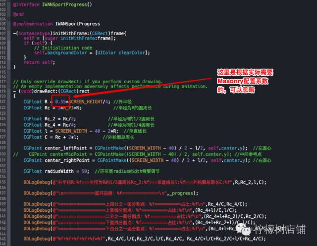

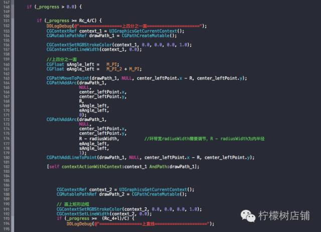

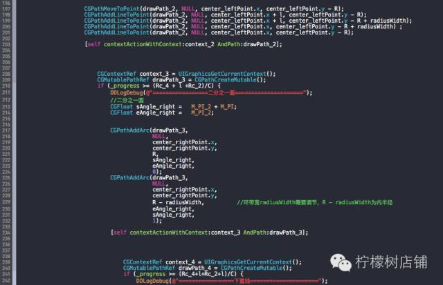

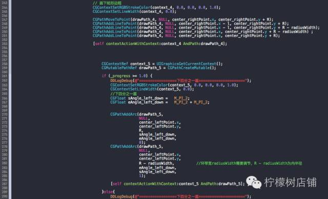

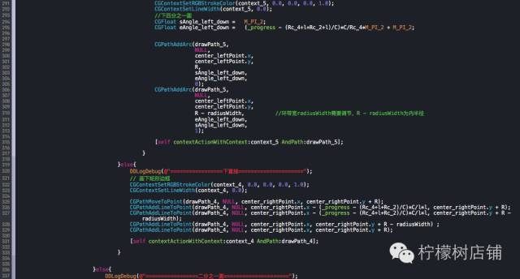

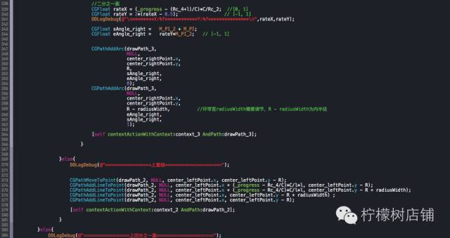

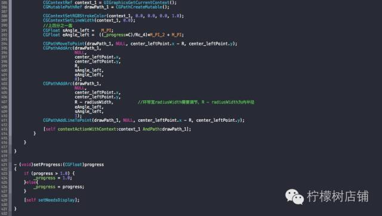

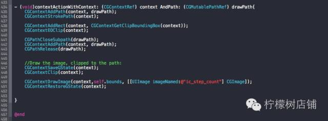


图片资源：

ic_step_count.png

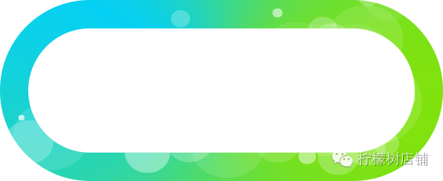


背景底色

bg_sport_step.png

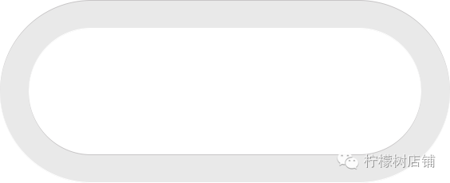

背景底色放置在绘制的图形图层之下。

源码：

**IWANSportProgressView.h**

```objective-c
//
//  IWANSportProgressView.h
//  iWan2
//
//  Created by XieYZ on 5/7/16.
//  Copyright © 2016年 Desay. All rights reserved.
//

#import <UIKit/UIKit.h>

@interface IWANSportProgressView : UIView
//椭圆进度条供外部传值
@property (nonatomic, assign) CGFloat progress;
//步数
@property (nonatomic, strong) UILabel *stepLabel;
@end


@interface IWANSportProgress : UIView
//椭圆进度条
@property (nonatomic, assign) CGFloat progress;
@end
```

**IWANSportProgressView.m**

```objective-c
//
//  IWANSportProgressView.m
//  iWan2
//
//  Created by XieYZ on 5/7/16.
//  Copyright © 2016年 Desay. All rights reserved.
//

#import "IWANSportProgressView.h"

@interface IWANSportProgressView()
@property (nonatomic, strong) UILabel *stepUnitLabel;
@property (nonatomic, strong) UIImageView *sportbg;

@property (nonatomic, strong) IWANSportProgress *sportProgressView;
@end

@implementation IWANSportProgressView


-(instancetype)initWithFrame:(CGRect)frame{
    self = [super initWithFrame:frame];
    if (self) {
        [self layoutView];
        [self viewStyle];
    }
    return self;
}

- (void)layoutView{
    WS(weakSelf)
    self.sportbg=[[UIImageView alloc]init];
    [self addSubview:self.sportbg];
    [self.sportbg mas_makeConstraints:^(MASConstraintMaker *make) {
        make.top.equalTo(weakSelf.mas_top);
        make.left.equalTo(weakSelf.mas_left);
        make.bottom.equalTo(weakSelf.mas_bottom);
        make.right.equalTo(weakSelf.mas_right);
    }];
    
    self.sportProgressView = [[IWANSportProgress alloc]init];
    [self addSubview:self.sportProgressView];
    [self.sportProgressView mas_makeConstraints:^(MASConstraintMaker *make) {
        make.top.equalTo(weakSelf.mas_top);
        make.left.equalTo(weakSelf.mas_left);
        make.bottom.equalTo(weakSelf.mas_bottom);
        make.right.equalTo(weakSelf.mas_right);
    }];
    
    self.stepLabel = [[UILabel alloc]init];
    [self addSubview:self.stepLabel];
    [self.stepLabel mas_makeConstraints:^(MASConstraintMaker *make) {
        make.centerX.equalTo(weakSelf.mas_centerX);
        make.centerY.equalTo(weakSelf.mas_centerY);
        make.height.equalTo(weakSelf.mas_height).multipliedBy(0.28);
        make.width.equalTo(weakSelf.mas_width).multipliedBy(0.6);
    }];
    
    self.stepUnitLabel = [[UILabel alloc]init];
    [self addSubview:self.stepUnitLabel];
    [self.stepUnitLabel mas_makeConstraints:^(MASConstraintMaker *make) {
        make.top.equalTo(weakSelf.stepLabel.mas_bottom);
        make.centerX.equalTo(weakSelf.mas_centerX);
        make.height.equalTo(weakSelf.mas_height).multipliedBy(0.25);
        make.width.equalTo(weakSelf.mas_width).multipliedBy(0.4);
    }];
    
   
}

- (void)viewStyle{
    self.backgroundColor = [UIColor colorWithRed:247.0/255.0 green:247.0/255.0 blue:247.0/255.0 alpha:1.0];
    
    self.sportbg.image=[UIImage imageNamed:@"bg_sport_step"];
    
    self.stepLabel.textColor = [UIColor orangeColor];
    self.stepLabel.font = [UIFont systemFontOfSize:32.0];
    self.stepLabel.text  = @"0";
    self.stepLabel.textAlignment = NSTextAlignmentCenter;
    
    self.stepUnitLabel.textColor = [UIColor lightGrayColor];
    self.stepUnitLabel.font = [UIFont systemFontOfSize:14.0];
    self.stepUnitLabel.text  = IWANLocalizedString(@"HomeStepUnitLabel", @"");
    self.stepUnitLabel.textAlignment = NSTextAlignmentCenter;
    
}

- (void)setProgress:(CGFloat)progress
{
    _progress = progress;
    self.sportProgressView.progress = _progress;
    [self setNeedsDisplay];
    
}


@end


@interface IWANSportProgress()

@end

@implementation IWANSportProgress

-(instancetype)initWithFrame:(CGRect)frame{
    self = [super initWithFrame:frame];
    if (self) {
        // Initialization code
        self.backgroundColor = [UIColor clearColor];
    }
    return self;
}

- (void)drawRect:(CGRect)rect
{
    CGFloat R = 0.55*SCREEN_HEIGHT/4; //外半径
    CGFloat Rc = 2*M_PI*R;            //半径为R的圆周长
    
    CGFloat Rc_2 = Rc/2;            //半径为R的1/2圆周长
    CGFloat Rc_4 = Rc/4;            //半径为R的1/4圆周长
    CGFloat l = SCREEN_WIDTH - 40 - 2*R;  //单直线长
    CGFloat C = Rc + 2*l;         //外轮廓总周长
    
    CGPoint center_leftPoint = CGPointMake((SCREEN_WIDTH - 40) / 2 - l/2, self.center.y);  //左圆心
    CGPoint center_rightPoint = CGPointMake((SCREEN_WIDTH - 40) / 2 + l/2, self.center.y); //右圆心
    CGFloat radiusWidth = 50;  //环带宽radiusWidth需要调节
   
    if (_progress > 0.0) {
        
       
        if (_progress >= Rc_4/C) {
            CGContextRef context_1 = UIGraphicsGetCurrentContext();
            CGMutablePathRef drawPath_1 = CGPathCreateMutable();
            
            CGContextSetRGBStrokeColor(context_1, 0.0, 0.0, 0.0, 1.0);
            CGContextSetLineWidth(context_1, 0.0);

            //上四分之一圆
            CGFloat sAngle_left =   M_PI;
            CGFloat eAngle_left =   M_PI_2 + M_PI;
            
            CGPathMoveToPoint(drawPath_1, NULL, center_leftPoint.x - R, center_leftPoint.y);
            CGPathAddArc(drawPath_1,
                         NULL,
                         center_leftPoint.x,
                         center_leftPoint.y,
                         R,
                         sAngle_left,
                         eAngle_left,
                         0);
            CGPathAddArc(drawPath_1,
                         NULL,
                         center_leftPoint.x,
                         center_leftPoint.y,
                         R - radiusWidth,
                         eAngle_left,
                         sAngle_left,
                         1);
            CGPathAddLineToPoint(drawPath_1, NULL, center_leftPoint.x - R, center_leftPoint.y);
            
            [self contextActionWithContext:context_1 AndPath:drawPath_1];
            
            
            

                CGContextRef context_2 = UIGraphicsGetCurrentContext();
                CGMutablePathRef drawPath_2 = CGPathCreateMutable();
                
                // 画上矩形边框
                CGContextSetRGBStrokeColor(context_2, 0.0, 0.0, 0.0, 1.0);
                CGContextSetLineWidth(context_2, 0.0);
                if (_progress >=  (Rc_4+l)/C) {
                    CGPathMoveToPoint(drawPath_2, NULL, center_leftPoint.x, center_leftPoint.y - R);
                    CGPathAddLineToPoint(drawPath_2, NULL, center_leftPoint.x + l, center_leftPoint.y - R);
                    CGPathAddLineToPoint(drawPath_2, NULL, center_leftPoint.x + l, center_leftPoint.y - R + radiusWidth);
                    CGPathAddLineToPoint(drawPath_2, NULL, center_leftPoint.x, center_leftPoint.y - R + radiusWidth) ;
                    CGPathAddLineToPoint(drawPath_2, NULL, center_leftPoint.x, center_leftPoint.y - R);
                    
                    [self contextActionWithContext:context_2 AndPath:drawPath_2];
                    
                        CGContextRef context_3 = UIGraphicsGetCurrentContext();
                        CGMutablePathRef drawPath_3 = CGPathCreateMutable();
                        if (_progress >= (Rc_4 + l +Rc_2)/C) {
                            CGFloat sAngle_right =   M_PI_2 + M_PI;
                            CGFloat eAngle_right =   M_PI_2;
                            
                            
                            CGPathAddArc(drawPath_3,
                                         NULL,
                                         center_rightPoint.x,
                                         center_rightPoint.y,
                                         R,
                                         sAngle_right,
                                         eAngle_right,
                                         0);
                            CGPathAddArc(drawPath_3,
                                         NULL,
                                         center_rightPoint.x,
                                         center_rightPoint.y,
                                         R - radiusWidth,
                                         eAngle_right,
                                         sAngle_right,
                                         1);
                            
                            [self contextActionWithContext:context_3 AndPath:drawPath_3];
                            
                                CGContextRef context_4 = UIGraphicsGetCurrentContext();
                                CGMutablePathRef drawPath_4 = CGPathCreateMutable();
                                if (_progress >= (Rc_4+l+Rc_2+l)/C) {
                                    CGContextSetRGBStrokeColor(context_4, 0.0, 0.0, 0.0, 1.0);
                                    CGContextSetLineWidth(context_4, 0.0);
                                    
                                    CGPathMoveToPoint(drawPath_4, NULL, center_rightPoint.x, center_rightPoint.y + R);
                                    CGPathAddLineToPoint(drawPath_4, NULL, center_rightPoint.x - l, center_rightPoint.y + R);
                                    CGPathAddLineToPoint(drawPath_4, NULL, center_rightPoint.x - l, center_rightPoint.y + R - radiusWidth);
                                    CGPathAddLineToPoint(drawPath_4, NULL, center_rightPoint.x, center_rightPoint.y + R - radiusWidth) ;
                                    CGPathAddLineToPoint(drawPath_4, NULL, center_rightPoint.x, center_rightPoint.y + R);
                                    
                                    [self contextActionWithContext:context_4 AndPath:drawPath_4];
                        
                                        CGContextRef context_5 = UIGraphicsGetCurrentContext();
                                        CGMutablePathRef drawPath_5 = CGPathCreateMutable();
                                        
                                        if (_progress >= 1.0) {
                                            CGContextSetRGBStrokeColor(context_5, 0.0, 0.0, 0.0, 1.0);
                                            CGContextSetLineWidth(context_5, 0.0);
                                            
                                            CGFloat sAngle_left_down =   M_PI_2;
                                            CGFloat eAngle_left_down =   M_PI_2 + M_PI_2;
                                            
                                            
                                            CGPathAddArc(drawPath_5,
                                                         NULL,
                                                         center_leftPoint.x,
                                                         center_leftPoint.y,
                                                         R,
                                                         sAngle_left_down,
                                                         eAngle_left_down,
                                                         0);
                                            CGPathAddArc(drawPath_5,
                                                         NULL,
                                                         center_leftPoint.x,
                                                         center_leftPoint.y,
                                                         R - radiusWidth,
                                                         eAngle_left_down,
                                                         sAngle_left_down,
                                                         1);
                                            
                                            [self contextActionWithContext:context_5 AndPath:drawPath_5];
                                            
                                        }else{
                                            CGContextSetRGBStrokeColor(context_5, 0.0, 0.0, 0.0, 1.0);
                                            CGContextSetLineWidth(context_5, 0.0);
                                            
                                            CGFloat sAngle_left_down =   M_PI_2;
                                            CGFloat eAngle_left_down =   (_progress - (Rc_4+l+Rc_2+l)/C)*C/Rc_4*M_PI_2 + M_PI_2;
                                            
                                            
                                            CGPathAddArc(drawPath_5,
                                                         NULL,
                                                         center_leftPoint.x,
                                                         center_leftPoint.y,
                                                         R,
                                                         sAngle_left_down,
                                                         eAngle_left_down,
                                                         0);
                                            CGPathAddArc(drawPath_5,
                                                         NULL,
                                                         center_leftPoint.x,
                                                         center_leftPoint.y,
                                                         R - radiusWidth,
                                                         eAngle_left_down,
                                                         sAngle_left_down,
                                                         1);
                                            
                                            [self contextActionWithContext:context_5 AndPath:drawPath_5];
                                            
                                        }

                                }else{
                                    CGContextSetRGBStrokeColor(context_4, 0.0, 0.0, 0.0, 1.0);
                                    CGContextSetLineWidth(context_4, 0.0);
                                    
                                    CGPathMoveToPoint(drawPath_4, NULL, center_rightPoint.x, center_rightPoint.y + R);
                                    CGPathAddLineToPoint(drawPath_4, NULL, center_rightPoint.x - (_progress - (Rc_4+l+Rc_2)/C)*C/l*l, center_rightPoint.y + R);
                                    CGPathAddLineToPoint(drawPath_4, NULL, center_rightPoint.x - (_progress - (Rc_4+l+Rc_2)/C)*C/l*l, center_rightPoint.y + R - radiusWidth);
                                    CGPathAddLineToPoint(drawPath_4, NULL, center_rightPoint.x, center_rightPoint.y + R - radiusWidth) ;
                                    CGPathAddLineToPoint(drawPath_4, NULL, center_rightPoint.x, center_rightPoint.y + R);
                                    
                                    [self contextActionWithContext:context_4 AndPath:drawPath_4];
                                    
                                }

                            
                        }else{
                            CGFloat rateX = (_progress - (Rc_4+l)/C)*C/Rc_2;
                            CGFloat rateY = 2*(rateX - 0.5);
                            
                            CGFloat sAngle_right =   M_PI_2 + M_PI;
                            CGFloat eAngle_right =   rateY*M_PI_2;
                            
                            
                            CGPathAddArc(drawPath_3,
                                         NULL,
                                         center_rightPoint.x,
                                         center_rightPoint.y,
                                         R,
                                         sAngle_right,
                                         eAngle_right,
                                         0);
                            CGPathAddArc(drawPath_3,
                                         NULL,
                                         center_rightPoint.x,
                                         center_rightPoint.y,
                                         R - radiusWidth,
                                         eAngle_right,
                                         sAngle_right,
                                         1);
                            
                            [self contextActionWithContext:context_3 AndPath:drawPath_3];
                            
                        }

                    
                }else{
                    CGPathMoveToPoint(drawPath_2, NULL, center_leftPoint.x, center_leftPoint.y - R);
                    CGPathAddLineToPoint(drawPath_2, NULL, center_leftPoint.x + (_progress - Rc_4/C)*C/l*l, center_leftPoint.y - R);
                    CGPathAddLineToPoint(drawPath_2, NULL, center_leftPoint.x + (_progress - Rc_4/C)*C/l*l, center_leftPoint.y - R + radiusWidth);
                    CGPathAddLineToPoint(drawPath_2, NULL, center_leftPoint.x, center_leftPoint.y - R + radiusWidth) ;
                    CGPathAddLineToPoint(drawPath_2, NULL, center_leftPoint.x, center_leftPoint.y - R);
                    
                    [self contextActionWithContext:context_2 AndPath:drawPath_2];
                    
                }

        }else{
            CGContextRef context_1 = UIGraphicsGetCurrentContext();
            CGMutablePathRef drawPath_1 = CGPathCreateMutable();
            
            CGContextSetRGBStrokeColor(context_1, 0.0, 0.0, 0.0, 1.0);
            CGContextSetLineWidth(context_1, 0.0);
            
            CGFloat sAngle_left =   M_PI;
            CGFloat eAngle_left =  ((_progress*C)/Rc_4)*M_PI_2 + M_PI;
            
            CGPathMoveToPoint(drawPath_1, NULL, center_leftPoint.x - R, center_leftPoint.y);
            CGPathAddArc(drawPath_1,
                         NULL,
                         center_leftPoint.x,
                         center_leftPoint.y,
                         R,
                         sAngle_left,
                         eAngle_left,
                         0);
            CGPathAddArc(drawPath_1,
                         NULL,
                         center_leftPoint.x,
                         center_leftPoint.y,
                         R - radiusWidth,
                         eAngle_left,
                         sAngle_left,
                         1);
            CGPathAddLineToPoint(drawPath_1, NULL, center_leftPoint.x - R, center_leftPoint.y);
            
            [self contextActionWithContext:context_1 AndPath:drawPath_1];
        }
        
    }
    
}


- (void)setProgress:(CGFloat)progress
{
    if (progress > 1.0) {
        _progress = 1.0;
    }else{
        _progress = progress;
    }
    
    [self setNeedsDisplay];
    
}


- (void)contextActionWithContext: (CGContextRef) context AndPath: (CGMutablePathRef) drawPath{
    CGContextAddPath(context, drawPath);
    CGContextStrokePath(context);
    
    CGContextAddRect(context, CGContextGetClipBoundingBox(context));
    CGContextEOClip(context);
    
    CGPathCloseSubpath(drawPath);
    CGContextAddPath(context, drawPath);
    CGPathRelease(drawPath);
    
    //Draw the image, clipped to the path:
    CGContextSaveGState(context);
    CGContextClip(context);
    
    CGContextDrawImage(context,self.bounds, [[UIImage imageNamed:@"ic_step_count"] CGImage]);
    CGContextRestoreGState(context);
    

}


@end

```

**Demo:**

```objective-c
CustomerView.h
#define WS(weakSelf)  __weak __typeof(&*self)weakSelf = self;
@interface CustomerView : UIView
//运动椭圆环
@property (nonatomic, strong) IWANSportProgressView *sportprogress;

@end
  
  
CustomerView.m
@implementation CustomerView

-(instancetype)initWithFrame:(CGRect)frame{
    self = [super initWithFrame:frame];
    if (self) {
          WS(weakSelf)
          self.sportprogress=[[IWANSportProgressView alloc]init];
          [self addSubview:self.sportprogress];
          [self.sportprogress mas_makeConstraints:^(MASConstraintMaker *make) {
              make.left.equalTo(weakSelf.mas_left).offset(20);
              make.right.equalTo(weakSelf.mas_right).offset(-20);
              make.top.equalTo(weakSelf.mas_top).offset(50);
              make.height.equalTo(weakSelf.mas_height).multipliedBy(0.5);
          }];
    }
    return self;
}


@end
```


[BackHome](http://robinshare.github.io/)